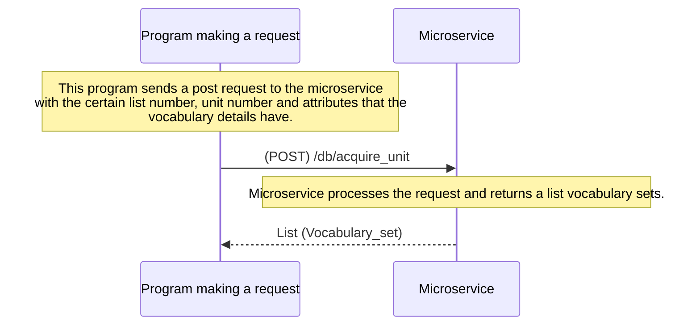

# test_microservice
- Assuming the server is running on the local machine and the port is 5000.
- Assuming the route is `/db/acquire_unit`
- The vocabulary database is attached in the repository as `GRE_3333.db`

## How to programmatically REQUEST data
To request data (vocabulary), you need to specify `the list number`, `the unit number` and `the attributes`.

Below are the attributes that you can specify.
```python
"word_id", "list", "unit", "meaning_id", "meaning_TW", "pronunciation_US", "pronunciation_UK", "how_to_memorize", "meaning_US", "sentence", "sentence_translate", "synonym", "antonym", "related", "transform", "notes"
```
An example script of sending a request to the microservice.
```python
import requests
import json

url = "http://127.0.0.1:5000/db/acquire_unit"

# We would like to acquire the vocabulary set of list 1, unit 6 and the attributes word, word_id, meaning_US, sentence
payload = json.dumps({
  "list": 1,
  "unit": 6,
  "attribute": [
    "word",
    "word_id",
    "meaning_US",
    "sentence",
  ]
})
headers = {
    'Content-Type': 'application/json'
}

response = requests.request("POST", url, headers=headers, data=payload, timeout=10)

# Now you have the response data
```

## How to programmatically RECEIVE data
```python
import requests
import json

url = "http://127.0.0.1:5000/db/acquire_unit"

payload = json.dumps({
  "list": 1,
  "unit": 6,
  "attribute": [
    "word",
    "word_id",
    "meaning_US",
    "sentence",
  ]
})
headers = {
    'Content-Type': 'application/json'
}

response = requests.request("POST", url, headers=headers, data=payload, timeout=10)

result = response.json()
result_dict = json.loads(result)

# Let's print the result with indentation
print(json.dumps(result_dict, indent=4))
```

This is an example of the printed response data
```json
[
    {
        "word": "assault",
        "word_id": "f7fd5b875fbe47da8d7b3077e422a9a5",
        "meaning_US": "a violent physical or verbal attack",
        "sentence": "He leveled a verbal assault against his Democratic opponents."
    },
    {
        "word": "dictum",
        "word_id": "7fc4234599894c7caa42db00d98db150",
        "meaning_US": "a noteworthy statement",
        "sentence": "Watch sellers employ a logical Italian dictum: a well-dressed man owns at least three timepieces."
    },
    {
        "word": "gouge",
        "word_id": "91abef832e6e4b6fb663898360ca0bdb",
        "meaning_US": "to subject to extortion or undue exaction",
        "sentence": "Banks and credit-card companies have been accused of gouging their customers."
    }
]
```

## UML Sequence Diagram
